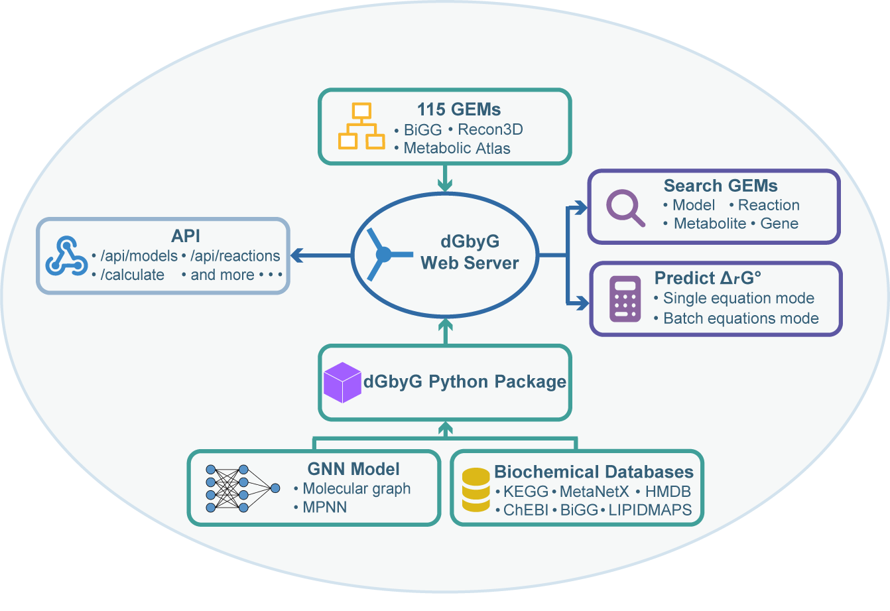

# dGbyG Web Server



The dGbyG web server (https://dgbyg.drziweidai.com/) supports diverse research scales through two primary modules. The **Search GEMs** module facilitates genome-scale thermodynamic analyses, enabling users to flexibly query models, reactions, metabolites, and genes to retrieve pre-computed Δ_r G°' profiles for 115 widely used genome-scale metabolic models (GEMs). For reaction-specific inquiries, the **Predict Δ_r G°'** module allows for single or batch predictions under user-defined conditions. To maximize usability, this predictive module accepts multiple identifier types and supports mixed inputs within a single reaction equation, ensuring a seamless user experience.

## Modules

### Search GEMs
Query pre-computed Δ_r G°' profiles across 115 genome-scale metabolic models. Supports flexible searches by:
- **Model** — retrieve thermodynamic conditions and statistics for a specific GEM
- **Reaction** — find reactions by ID or name and view their Δ_r G°' across models
- **Metabolite** — search metabolites and explore their associated reactions
- **Gene** — look up genes and their catalyzed reactions via GPR associations

### Predict Δ_r G°'
Predict standard Gibbs energy changes for individual reactions or in batch under user-defined physicochemical conditions (pH, ionic strength, pMg, electric potential). Accepts the following identifier types, including mixed inputs within a single equation:

- SMILES
- InChI
- InChIKey
- KEGG compound ID
- MetaNetX chemical ID
- ChEBI ID
- HMDB ID
- BiGG universal metabolite ID
- PubChem compound CID
- MOL file
- RXN file
- Compound name

## API

The server also exposes a REST API for programmatic access. Documentation is available at https://dgbyg.drziweidai.com/api.

## Repository Structure

```
├── dgbygapp/          # Flask web application (routes, templates, static files)
├── BIGG/              # Pre-computed ΔG data and search engine for 115 GEMs
├── requirements.txt   # Python dependencies
└── DEPLOYMENT.md      # Server deployment notes
```

## Citation

If you use dGbyG web server in your research, please cite:

> [Citation will be added upon publication]

## License

This project is licensed under the MIT License. See [LICENSE](LICENSE) for details.
